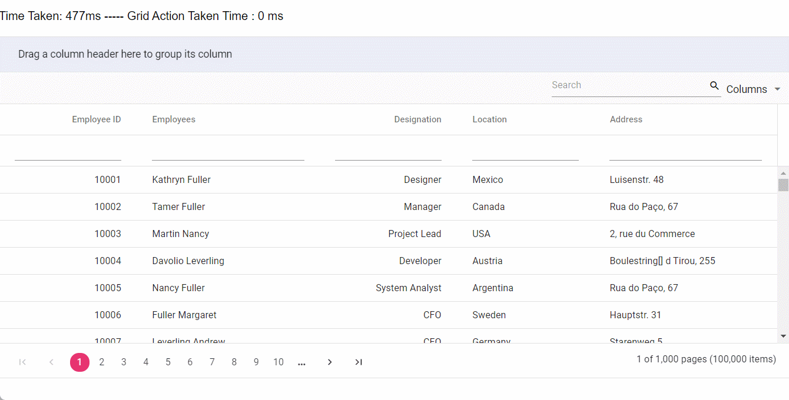

# React-Grid-performance-sample

In this demo, the grid is configured to bind 100,000 records across 5 columns. This sample is designed to evaluate performance during the initial rendering of the grid and various data operations, including sorting, filtering, searching, grouping, and paging with different page sizes. You can assess performance by adjusting the page size via the pageSize value in the [pageSettings](https://ej2.syncfusion.com/react/documentation/api/grid/pageSettings/#pagesize) property at the sample level. Additionally, you have the option to enable virtual scrolling by setting [enableVirtualization](https://ej2.syncfusion.com/react/documentation/api/grid/#enablevirtualization), or you can choose to test with pagination by enabling the [allowPaging](https://ej2.syncfusion.com/react/documentation/api/grid/#allowpaging) feature. If you prefer to explore infinite scrolling, you can activate the [enableInfiniteScrolling](https://ej2.syncfusion.com/react/documentation/api/grid/#enableinfinitescrolling) feature at the sample level.

> Note: Paging, Virtual Scrolling, and Infinite Scrolling are unique features, meaning only one of these can be enabled at a time.

Refer to the following link for more information in the documentation.

[Paging](https://ej2.syncfusion.com/react/documentation/grid/paging) <br/>
[virtual scroll](https://ej2.syncfusion.com/react/documentation/grid/scrolling/virtual-scrolling) <br/>
[Infinite scroll](https://ej2.syncfusion.com/react/documentation/grid/scrolling/infinite-scrolling)



## Run 
Use the following command to run the sample
``` bash
# install dependencies
npm install

# run the application
npm start

```
